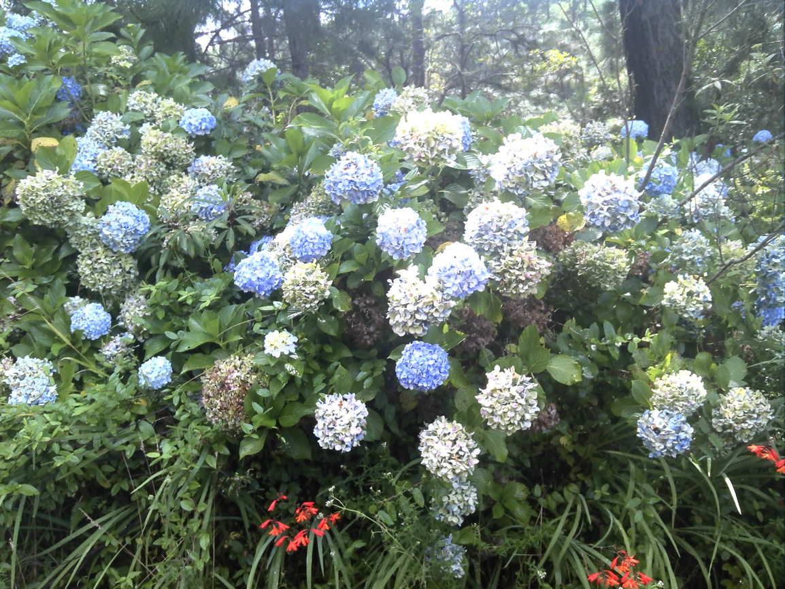
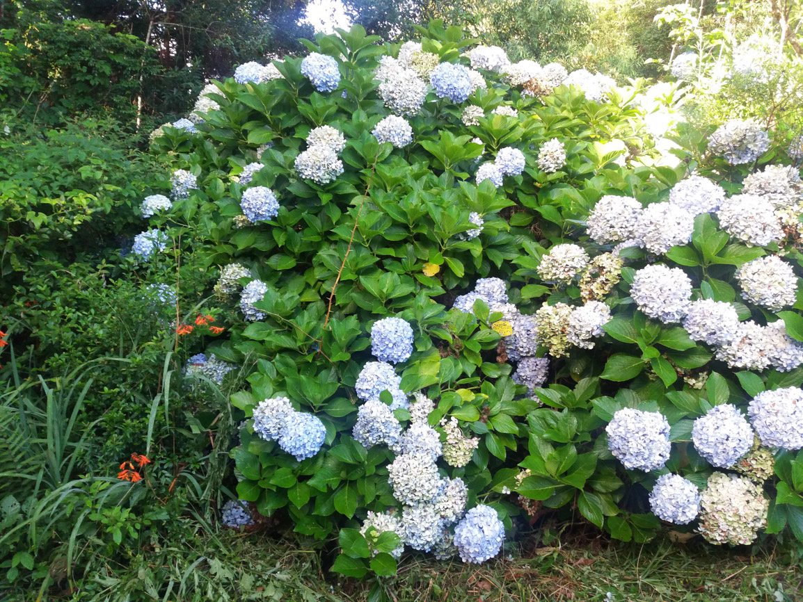
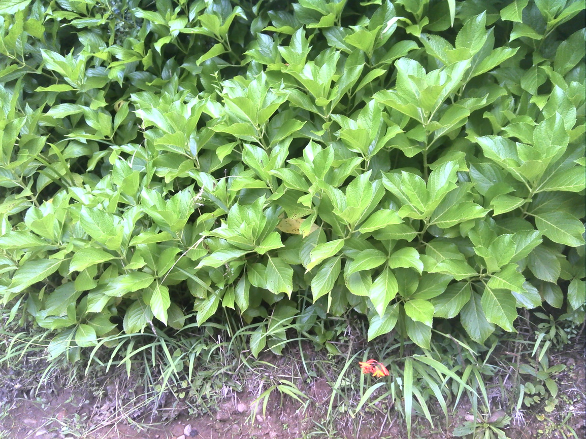
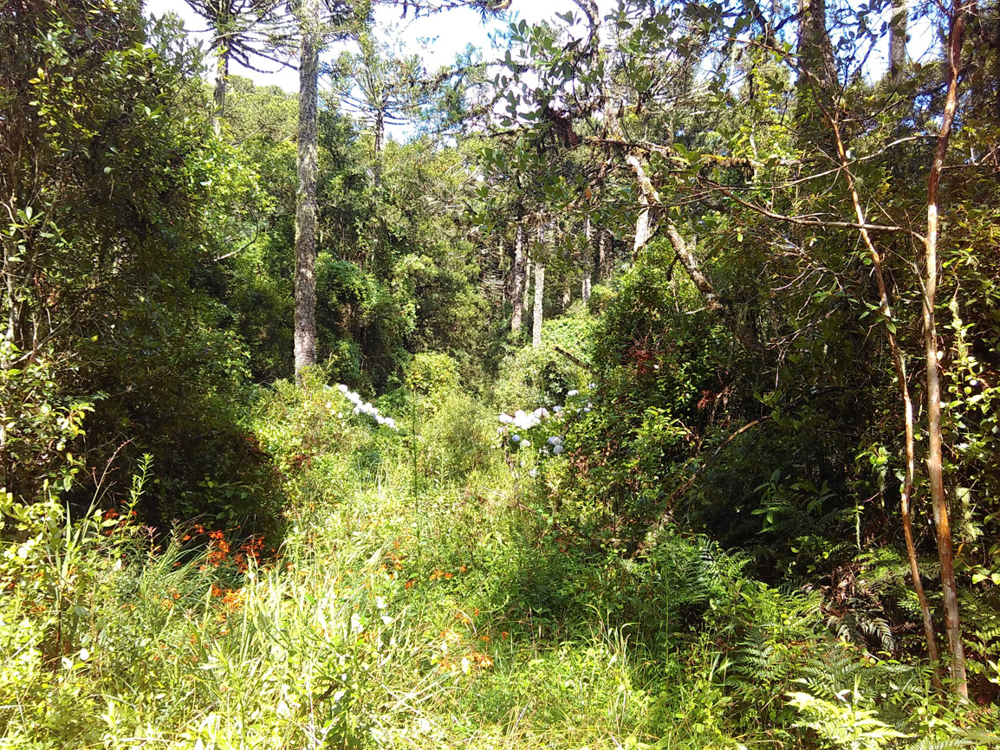
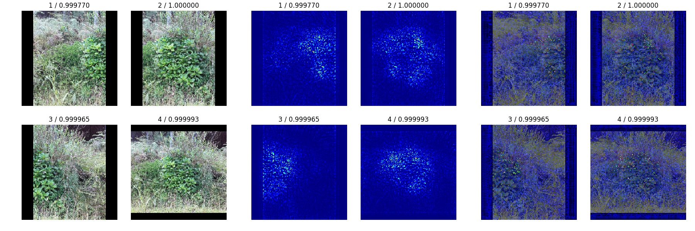

---
output:
  html_document: default
  pdf_document: default
---
# InvasiveSpeciesMonitoring

## Introduction

The motivation of this Kaggle competition is to apply machine learning and deep learning technique to automatically detect the presence or absence of invasive species, which can have damaging effect on the local environment and economy. 

In the Kaggle *Invasive Species Monitoring* competition, the data set contains pictures taken in a Brazilian national forest. In some of the pictures there is **Hydrangea**, a beautiful invasive species original of Asia. The rest are simple background images, such as jungles, houses or even local people and animals like horses. Based on the training pictures and the labels provided, the participant should predict the presence of the invasive species in the testing set of pictures. The dataset contains 2295 training images and 1531 test images. All are  color images with 866 x 1154 pixels in size. Typical examples of positive and negative examples of invasive species are shown below:

## Main method

### Transfer Learning

We applied VGG-16 trained on ImageNet as our pretrained model and replace the last fc-layers of the original VGG-16 net with a new fc-layer and finally a final output node with sigmoid activation, the score of which gives the prediction probability of the input images.

#### How to train?

- Train only the added layers
- Train the added layers first and then fine-tuning a few top layers of the pretrained VGG-16 model
- Train the entire model

#### How to preprocess the training images?

It might be important to include as much information of the original input as possible. Since for some amount of the training images, the invasive plant only takes a small part of the entire image. If we take random crop before resizing, it may accidentally leave out the important info. 

We apply the preprocessing technique of this Kaggle post [[1]][1]. Basically, the images are down-sized to 256 x 256 pixels, filling the short edges by zeros. The resized images are then cropped to 224 x 224 before feed into the VGG-16 model.

#### Downsampling method

area, bilinear, Lanczos

#### How to preprocess images at the test phase?

This is motivated by the fact that some of the hard to predict images contain invasive plants hidden far in the background of the images. Thus it may be helpful to crop the test images at different positions and scales, and enhance the prediction by ensemble them.

- predict once with the entire image, same preprocessing as train images
- crop 3x3 blocks, ensemble 9 predictions with mean or max
- crop 2x2 blocks, plus center crop , ensemble 5 predictions with mean or max
- center crops at various scale, [0, 0.1, 0.2, 0.3] (portion cropped from 4 edges), ensemble with mean of max-2 or mean of 4
- 3 crops of half-width, [left, center, right], plus 1 prediction with entire images, take mean or max

[1]: https://www.kaggle.com/fujisan/use-keras-pre-trained-vgg16-acc-98

## Results

### Saliency map

### Downsampling method

Downsize method | Val Acc | Val AUC | LB Score (AUC)
--- | --- | --- | --- 
cv2.INTER_LINEAR (default) | 0.984749 | 0.998239 | 0.98536
cv2.INTER_AREA | 0.989107 * | 0.998742 * | 0.98457
cv2.INTER_LANCZOS4 | 0.986928 | 0.998065 | 0.98813 *

### Different cropping methods at test phase (Bilinear)

Cropping method | Val Acc | Val AUC | LB AUC
--- | --- | --- | ---
entire | 0.984749 * | 0.99824 * | 0.98536
centeredx4 mean | 0.967320 | 0.99445 | 0.98402
centeredx4 max-2 | 0.958606 | 0.99540 | 0.98442
lmr+entire mean | 0.976035 | 0.99644 | 0.98666 *
lmr+entire max | 0.943355 | 0.99576 | 

### Different training strategy (Lanczos)

Training Strategy | Val Acc | Val AUC | LB AUC
--- | --- | --- | ---
train whole | 0.986928 * | 0.998065 | 0.98813 *
train added layers | 0.982571 | 0.998452 | 
train added layers + fine tune top layers | 0.978214 | 0.998220 
train added layers + fine tune all | 0.986928 * | 0.998742 * | 0.98578

## Conclusion

- Simply train the entire model
- Use Lanczos downsampling
- Use 3 + 1 (left, center, right + whole) at the test image prediction stage
- Try bagging and ensembling